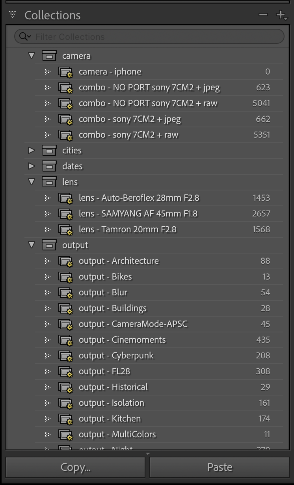

> Speed up kickstarting post-processing project(s) with Adobe Lightroom and Adobe Bridge.

## Usage

> [!important] Before you get started, it's important to emphasise that you use these bootstrapping files at your own risk.
>
> It's generally a good practice that you experiment with these on sample Lightroom project and/or you diligently cleanup after yourself in the settings of your Adobe Bridge installation before you starting applying them to amend your workflow within Lightroom and Bridge respectively.

## Installation

```
❯ yarn install
```

## The boot file

1. You copy the `boot.config.sample.yaml` to `boot.config.yaml`.
2. You edit this file and add your own preferences and configurations

### Example

```yaml
# It is recommended to use PascalCase
namespace: MyProject

Author: ADDIE

collections:
  # generic categories across multiple themes
  agnostic:
    - name: ISO_COATED_V2
      category: Conversions

  # themed categories, genre specific
  themes:
    - name: Sunrise
      category: Motive
    - name: Sunset
      category: Motive

  # lightroom collection definitions
  # adjust these to your liking.
  definitions:
    # CAMERAS + FILE_FORMAT
    - name: Sony 7ii + JPEG
      prefix: 'camera'
      combineType: intersect
      config:
        pick:
          criteria: camera
          operation: any
          value: Sony ILCE-7M2
        fileFormat:
          criteria: fileFormat
          operation: '=='
          value: JPEG
```

> Adjust `definitions` at your own risk.
> To understand better how `definitions[*].config` works, you will have to inspect the your existing Lightroom collection first.
> From there, you get a good idea of how a configuration for a Lightroom collection could look like and you can start small by experimenting with new collections that matches your preferences.
> You are free to delete the `definitions` section entirely.

## Building your collections

Run the following script:

```
❯ yarn build
```

Inspect the `/output` folder and have a look at the generated collections for Lightroom and Bridge respectively.

## Output

### `output/Adobe Bridge Keywords.txt`

The file is the importable **Keywords** for Adobe Bridge.
To import this; Go to `Adobe -> Keywords Panel -> Import`.


### `output/Metadata Templates`

This is a collection of reusable _Metadata Templates_ that you apply to your images in Adobe Bridge.

These files are intended for you to copy these over into your Adobe Bridge settings.

In MacOS; the placement of these templates can be `/Users/<THIS_IS_YOU>/Library/Application Support/Adobe/XMP`.

### `output/Lightroom/Keyword Sets`

This is a collection of reusable _Keyword Sets_ across your Lightroom Projects.

These files are intended for you to copy these over into your Adobe Lightroom settings.

In MacOS; the placement of these templates can be `/Users/<THIS_IS_YOU>/Library/Application Support/Adobe/Lightroom`

Once you've done this, you can expect your _Keyword Sets_ to display in the list of options of the **Keywording** panel of Lightroom.


### `output/Lightroom/Collections `

These are the Lightroom **Smart Collections** that you can use in a single Lightroom project.

You import them into Lightroom, so you transform your **Smart Collections**.

> [!info] Note that **Smart Collections** are **per project** in Lightroom.
> When you kickstart a new Lightroom project, you import them again.

#### Example

**Before**


**After**


